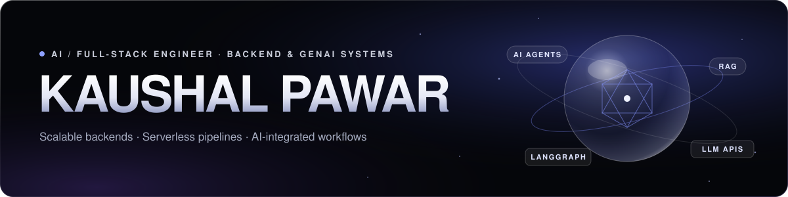

  I build production mobile and web apps, scalable backends, serverless pipelines and AI-integrated workflows.

  
  
  

---

### About me

- 🎓 B.Tech in Electronics & Communication Engineering at **SVNIT Surat** (2022 – 2026)
- 💼 Software Development Intern at **TouchStone Foundation** (May – July 2025): customized ERP modules with Python and Frappe, and built backend APIs, schemas and server-side workflows
- 🧠 Working with LLM APIs, RAG, AI agents, LangGraph, Firebase, Supabase and serverless architectures
- 🚀 I take products from prototype to production: architecture, backend, release and ownership

### Featured work

| Project | What it is | Stack |
|---|---|---|
| **[Instagram Content Repurposing Pipeline](https://github.com/KaushalPawar14/Insta-Post-Regenerate)** | Multi-tenant AI SaaS that ingests Instagram content and generates original brand-templated posts, with human approval before paid AI generation. A LangGraph workflow re-architected into a stateless, queue-driven serverless pipeline. | LangGraph · Upstash QStash · Vercel Python · Supabase |
| **[FOLK — Spiritual Mentorship Platform](https://github.com/KaushalPawar14/Sadhana-App-for-Users)** | Two production Android apps on Google Play (student + [mentor](https://github.com/KaushalPawar14/Sadhana-App-for-Admin)) for 200+ students across multiple campuses. Firebase backend with 29 Cloud Functions, AI-assisted goal planning and a RAG assistant over 100+ books. | Flutter · Firebase · Firestore · FCM · Cloud Functions · RAG |
| **[Ren Basera — ERP-Based Management System](https://github.com/KaushalPawar14/RenBasera-Frappe-System)** | ERP-based shelter management system with REST APIs, workflow automation, occupancy tracking and reporting. | Python · JavaScript · SQL · Frappe |

### Tech stack

**Languages:** Python · JavaScript · SQL · C++ · Dart (Flutter) 
**AI / GenAI:** LLM APIs · Prompt Engineering · RAG · AI Agents · LangChain · LangGraph · MCP · LLM Evaluation · LLMOps 
**Backend & APIs:** FastAPI · REST APIs · Firebase · Firestore · Cloud Functions · Authentication · RBAC · Workflow Automation 
**Software Engineering:** Software Architecture · System Design · OOP · Debugging · Git · GitHub 
**DevOps & Cloud:** Docker · CI/CD · Cloud Deployment · Environment Variables & Secrets · Linux · Logging · Monitoring

  

### Currently interested in

Generative AI, scalable backend engineering, AI agents, LLM evaluation and AI-native software development.

---

Open to conversations about AI, backend and full-stack engineering roles → <a href="mailto:kaushalapawar@gmail.com">kaushalapawar@gmail.com</a>

